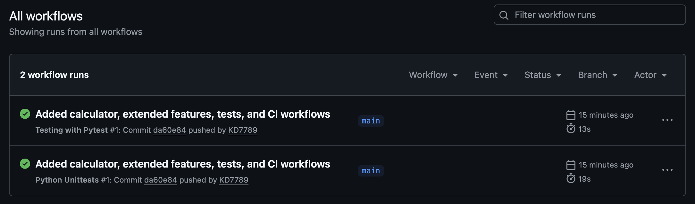

# MLOps Lab 1: Testing a Python Calculator with GitHub Actions


A small Python project with a calculator module, unit tests in both pytest and unittest, and GitHub Actions workflows that run the tests automatically on every push.

Based on the course lab: https://github.com/raminmohammadi/MLOps/tree/main/Labs/Github_Labs/Lab1

## Project structure

```
src/calculator.py          calculator functions
data/
test/test_pytest.py        pytest tests
test/test_unittest.py      unittest tests
.github/workflows/
  pytest_action.yml        runs pytest
  unittest_action.yml      runs unittest
screenshots/               CI screenshot
requirements.txt
```

## Running the tests

```bash
pip install -r requirements.txt
python -m pytest
python -m unittest test.test_unittest
```

## What I changed from the original lab

**Calculator (`src/calculator.py`)**
- Added five new functions: `divide`, `power`, `average`, `modulo`, `sqrt`
- Added `_check_numbers`, one helper that every calculator function now calls to check its inputs. It also refuses `True`/`False`, which Python would otherwise accept as the integers 1 and 0.
- `fun1`-`fun3` use that helper in place of their own inline checks, so they reject booleans too (`fun1(True, 1)` used to return 2)
- `fun4` now rejects non-numeric arguments; before, it accepted anything `+` could handle (e.g. `fun4("a", "b", "c")` returned `"abc"`)
- Error handling: `ZeroDivisionError` for divide and modulo by zero and for `power(0, -1)`; `ValueError` for invalid input, negative `sqrt`, empty `average`, and a negative base with a fractional exponent in `power`

**Tests**
- Tests for every new function in both pytest and unittest, covering normal cases and error cases
- Tests for the `fun4` validation, boolean rejection in `fun1`-`fun3`, and `power(0, -1)`
- Total: 19 tests in each file

**GitHub Actions**
- Workflows moved to `.github/workflows/` so they run from the repo root
- Added a Python 3.10 / 3.11 / 3.12 test matrix and pip caching
- Fixed the starter workflows (a `run-nam` typo, conflicting branch filters, unneeded issue/label triggers) and updated outdated versions (`checkout@v4`, `setup-python@v5`, `upload-artifact@v4`, Python 3.10-3.12). They now run on push, pull request, and manual dispatch.
- Each matrix run saves its own pytest XML report, so results can be downloaded per Python version

## CI status

